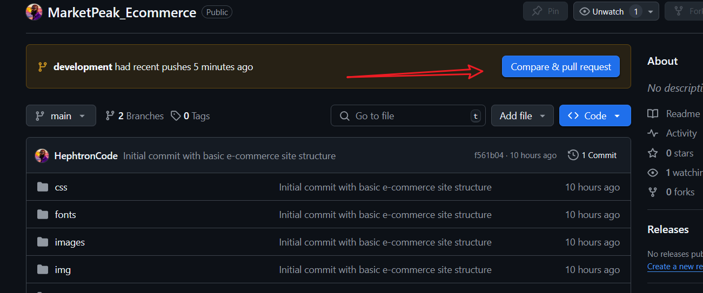
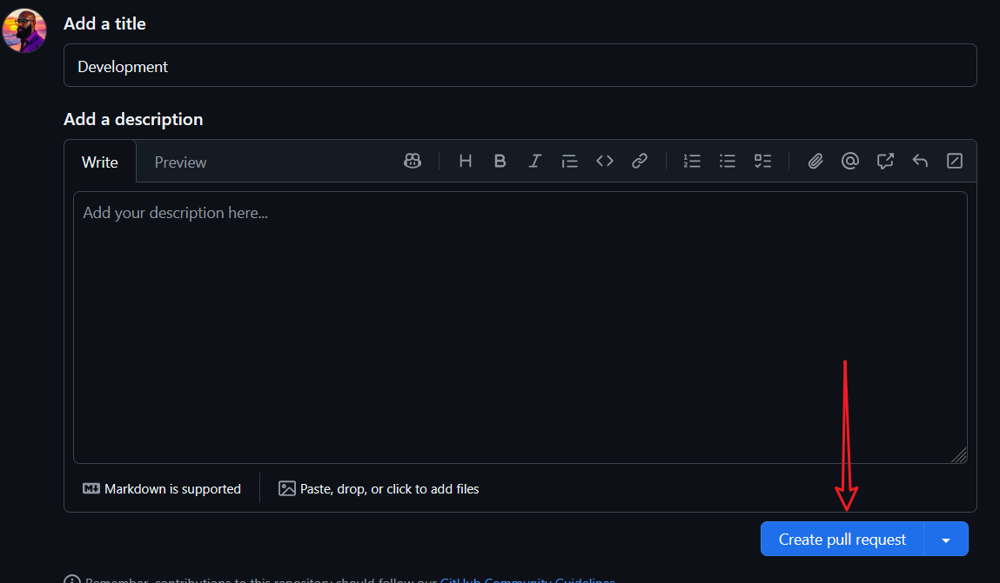
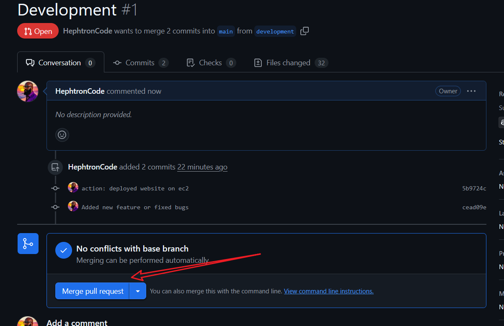
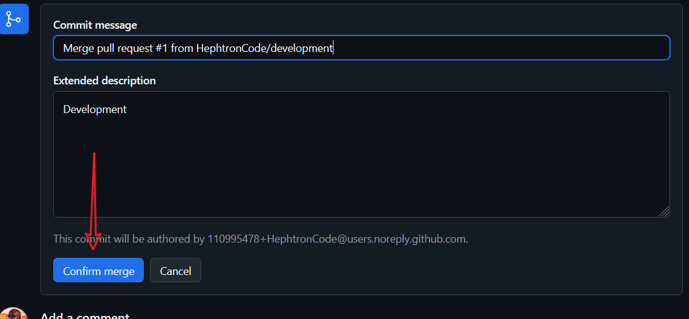
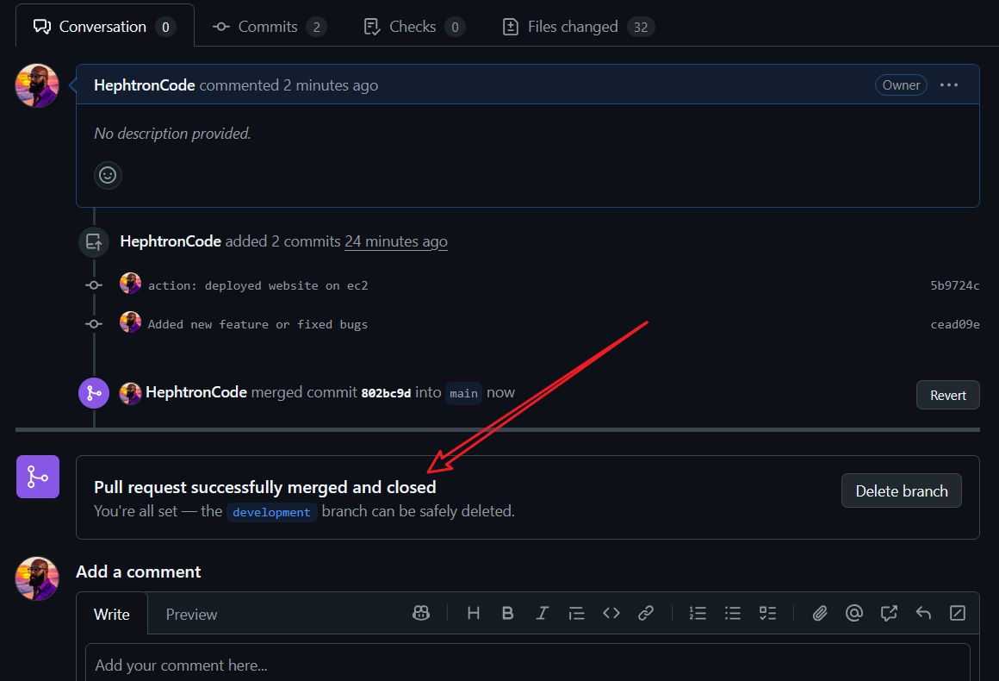
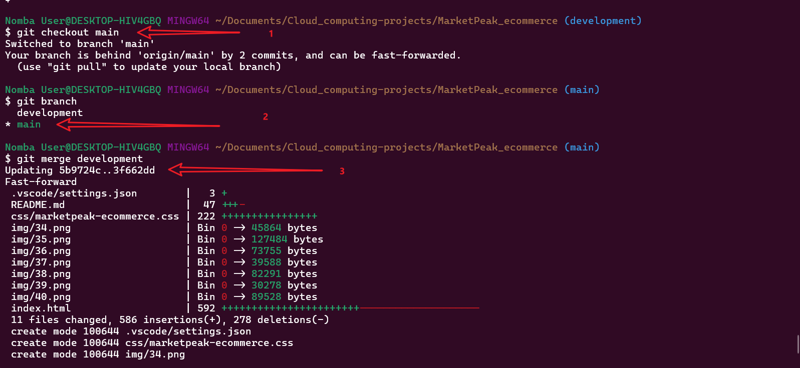
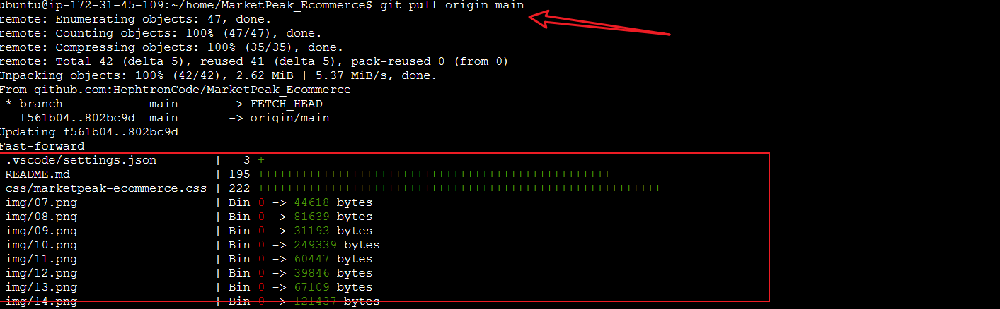
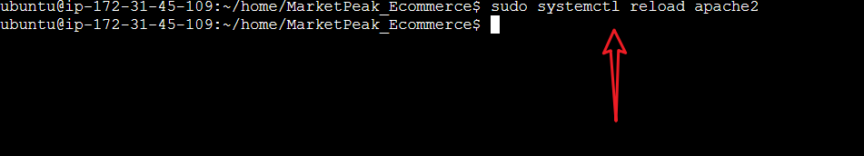
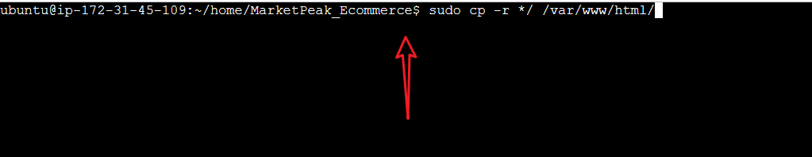
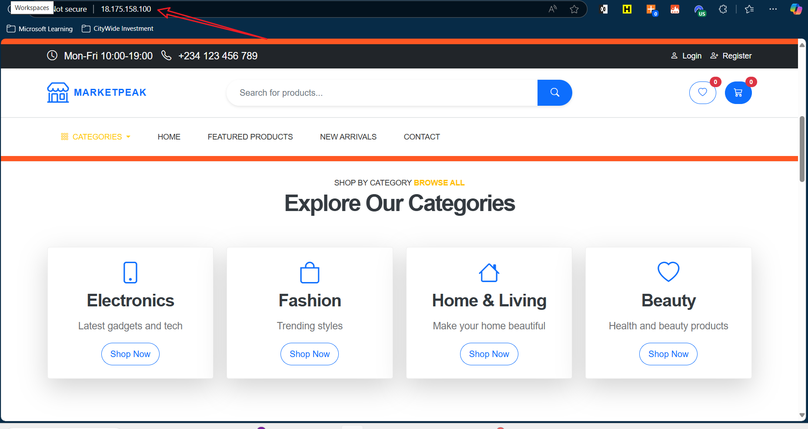

# Project Title: Marketplace E-commerce
# Description: A simple e-commerce marketplace built with HTML and Bootstrap.
This project is a simple e-commerce marketplace built with HTML and Bootstrap. It includes a homepage, product listing page, product details page, and a shopping cart page. The project is designed to be responsive and user-friendly, making it easy for users to navigate and find products.

# Project Specification:
The purpose of this project is to create a simple e-commerce marketplace built in linux environment, staged and pushed to Github using the gitbash command line interface. This in turn will be hosted on AWS EC2 instance.

## Implementation Steps:
1. Create a new directory called `MarketPeak E-commerce` using the `mkdir` command.
```bash
mkdir MarketPeak_e-commerce
```


2. Copy the content of the downloaded template into the `MarketPeak E-commerce` directory. You can use the `cp` with `-r` command to copy files and directories.
```bash
cp -r 2130_waso_strategy MarketPeak_e-commerce/ 
```


3. Navigate to the `MarketPeak E-commerce` directory using the `cd` command.
```bash
cd MarketPeak_e-commerce
```


4. Initialize a new Git repository using the `git init` command.
```bash
git init
```


5. List the contents of the directory using the `ls` with the `-lh` command to verify that the files have been copied successfully.
```bash
ls -lh
```


What the above command does is to list the files in the current directory in a human-readable format, showing file sizes in a more understandable way (e.g., KB, MB). The `-l` option provides a detailed listing, while the `-h` option makes the file sizes easier to read.

6. Edited the `index.html` file using the vscode editor. You can use the `code` command to open the file in Visual Studio Code.
```bash
code index.html
```


In the `index.html` file, I made some changes to the content and layout of the page. I added a header, a navigation bar, and a footer. I also included some sample products with images and descriptions. The changes were made using HTML and Bootstrap classes to ensure a responsive design.

7. Add all the files to the staging area using the `git add` command.
```bash
git add .
```

The `git add .` command stages all changes in the current directory and its subdirectories for the next commit. The `.` indicates that all files and directories should be added.

8. Checking my git global configuration list using the `git config` with `--list` command.
```bash
git config --list
```
***Note that I already have my git global configuration set up. However, to add the git configurations you use the `git config --global user.name "Your Name"` and `git config --global user.email "your.email@example.com"` commands.***
```bash
git config --global user.name "Your Name"
git config --global user.email "your.email@example.com"
```


The highlighted line in the above image shows that I have set my global username and email address for Git. This information is used to identify the author of commits in the repository.

9. Committing the changes using the `git commit` command with a message.

```bash
git commit -m "Initial commit with basic e-commerce site structure"
```


The `git commit -m "Initial commit with basic e-commerce site structure"` command creates a new commit with the staged changes and includes a message describing the changes made. The `-m` option allows you to specify the commit message directly in the command line.

## Pushing Codes to Github Repo:
1. Create a new repository on GitHub. Go to your GitHub account, click on the "+" icon in the top right corner, and select "New repository." Name it `MarketPeak_e-commerce` and click "Create repository." or from the repo dashboard, click in the new repository button.


2. Name the repository `MarketPeak_e-commerce` and click on the "Create repository" button.


3. Link the local repository to the remote one using the ssh git remote add command. You can find the SSH URL on the GitHub repository page. Use the following command to add the remote repository:
```bash
git remote add origin <SSH-URL>
```


The `git remote add origin <SSH-URL>` command adds a new remote repository named `origin` to your local Git repository. The `<SSH-URL>` is the URL of the remote repository on GitHub, which allows you to push and pull changes between your local and remote repositories.

4. Push the changes to the remote repository using the `git push` command.
```bash
git push -u origin main
```

The `git push -u origin main` command pushes the local `main` branch to the remote repository named `origin`. The `-u` option sets the upstream tracking relationship, allowing you to use `git push` and `git pull` without specifying the remote and branch names in the future.

5. After pushing the changes, you can go to your GitHub repository page and refresh it to see the files you just pushed.


## AWS Deployment:
1. Log into your AWS account and navigate to the EC2 dashboard.


2. Select services and select compute and then click on EC2.


3. If you already have an EC2 instance created, you can skip this step. Otherwise, click on the "Launch Instance" button to create a new EC2 instance. 
***I already have an EC2 instance created, so I will skip this step. Instead I will click on the "Instances" link in the left sidebar to view my existing instances.***


4. Once it launches your EC2 click on the checkbox beside to instance name to show more details about the instance.


In the above image, the caption 1 shows the instance name, caption 2 shows the instance ID, caption 3 shows the state of the instance (either running or stopped), caption 4 shows the instance type, and caption 5 shows the availability zone.

5. On the page go to instance state and click on the `Start instance` button to start the instance.


You will notice a pop-up message confirming that the instance is starting. Once the instance is started, you will see the status change to "running" in the EC2 dashboard.


In the above image, noticed that upon starting the instance, the state changed to "running" and at the botton you now have a public IPv4 address assigned as well as a private IPv4 address. The public IPv4 address is used to access the instance from the internet, while the private IPv4 address is used for internal communication within the AWS network. ***Side note: The public IPv4 address may change if the instance is stopped and started again, unless you have an Elastic IP assigned to it.***

6. Click on the `Connect` button to get the connection details for your instance.


Upon clicking on the connect it takes your to a new page with connection details. Unless otherwise for other purposes, leave everything as default and click on the `Connect` button.


7. Once connected, you will see a terminal window where you can run commands on your EC2 instance.


The above image shows the terminal window where you can run commands on your EC2 instance. You can use this terminal to install software, configure settings, and manage files on your instance.

8. Connect to your EC2 instance using SSH. Open a terminal on your local machine and use the following command to connect to your instance:
```bash
ssh -i /path/to/your-key.pem ec2-user@your-instance-public-ip
```


You can get the public IP address of your instance from the EC2 dashboard. Make sure to replace `/path/to/your-key.pem` with the path to your private key file and `your-instance-public-ip` with the public IP address of your instance.

9. Setup SSH key in order to clone the repository from GitHub. You can do this by running the following command in your terminal:
```bash
ssh-keygen -t rsa -b 4096 -C "your.email@example.com"
```


The `ssh-keygen` command generates a new SSH key pair (public and private keys) for secure communication with remote servers. The command will prompt you to specify a file location to save the key pair, and you can press Enter to accept the default location. You can also set a passphrase for added security, but it's optional.

10. After generating the SSH key, you will find the public key in the `~/.ssh/id_rsa.pub` file. You can view the contents of this file using the following command:
```bash
cat ~/.ssh/id_rsa.pub
```
11. Copy the contents of the key and add it to your GitHub account. Go to your GitHub account settings, click on "SSH and GPG keys," and then click on "New SSH key." Paste the copied key into the key field and give it a title. Click "Add SSH key" to save it.


12. Test the SSH connection to GitHub by running the following command:
```bash
ssh -T git@github.com
```


13. Clone the repository from GitHub to your EC2 instance using the following command:
```bash
git clone <repository-url> 
```


14. Install a web server on your EC2 instance. You can use Apache or Nginx. For example, to install Apache, run the following command:
```bash
sudo apt install apache2 -y
```


The `sudo apt install apache2 -y` command installs the Apache web server on your EC2 instance. The `-y` option automatically confirms the installation without prompting for user input.

15. Start the Apache web server using the following command:
```bash
sudo systemctl start apache2
```


The `sudo systemctl start apache2` command starts the Apache web server service on your EC2 instance. The `systemctl` command is used to manage system services in Linux, and the `start` option tells it to start the specified service (in this case, Apache).

***Side note: while start the apache server, I encountered and error where nginx was already running and using the port 80. Using sudo lsof -i :80 command I was able to find the process using the port and then I used the kill command to terminate the process.***
```bash
sudo lsof -i :80
sudo kill -9 <PID>
```
## Prepare the HTML files for deployment:
1. Delete the default Apache index.html file using the following command:
```bash
sudo rm -r /var/www/html/index.html
```
2. Copy the contents of your cloned repository to the Apache web server's root directory using the following command:
```bash
sudo cp -r /path/to/your/cloned/repo/* /var/www/html/
```


The `sudo cp -r /path/to/your/cloned/repo/* /var/www/html/` command copies all files and directories from your cloned repository to the Apache web server's root directory (`/var/www/html/`). The `-r` option is used to copy directories recursively, ensuring that all files and subdirectories are included in the copy.

3. Reload the Apache web server to apply the changes using the following command:
```bash
sudo systemctl reload apache2
```


The `sudo systemctl reload apache2` command reloads the Apache web server configuration without stopping the server. This allows you to apply changes to the configuration files or content without interrupting the service.

4. Open a web browser and enter the public IP address of your EC2 instance to access your deployed e-commerce site.


## Continous Integration and Deployment (CI/CD) Workflow:
1. Developing a new feature or fixing a bug in your local repository. Make changes to the code and test them locally.
- Create a new branch called `development` using the following command:
```bash
git checkout -b development
```


The `git checkout -b development` command creates a new branch called `development` and switches to that branch. This allows you to work on new features or bug fixes without affecting the main branch. In the above image, the caption 1 shows the previous branch name which is `main`, caption 2 shows the new branch name which is `development`.

2. Make changes to the code and test them locally. Once you are satisfied with the changes, add and commit them using the following commands:
```bash
git add .
git commit -m "Added new feature or fixed bug"
git push origin development
```


The `git add .` command stages all changes in the current directory and its subdirectories for the next commit. The `git commit -m "Added new feature or fixed bug"` command creates a new commit with the staged changes and includes a message describing the changes made. The `git push origin development` command pushes the local `development` branch to the remote repository named `origin`.
The `origin` is the default name for the remote repository that you cloned from GitHub. The `development` branch is the branch where you made your changes.

***Note: In the above image, I was able to use two git commands in one line by separating them with a `&&` operator. This allows you to run multiple commands sequentially, where the second command will only execute if the first command is successful.***

3. Create a pull request on GitHub to merge the changes from the `development` branch into the `main` branch. Go to your GitHub repository page, click on the "Pull requests" tab, and then click on the "New pull request" button. Select the `development` branch as the source and the `main` branch as the target. Click on "Create pull request" to submit it.











The above image shows the pull request page where you can review the changes made in the `development` branch before merging them into the `main` branch. You can add comments, request reviews from other team members, and discuss any issues related to the changes.
Once you are satisfied with the changes, you can click on the "Merge pull request" button to merge the changes into the `main` branch.

4. Checkout to the main branch and merge the changes from the `development` branch using the following command:
```bash
git checkout main
git merge development
```


The `git checkout main` command switches to the `main` branch, and the `git merge development` command merges the changes from the `development` branch into the `main` branch. This allows you to incorporate the new feature or bug fix into the main codebase.

***Note: It is important to always confirm that you have been able to switch branch successfully. You can do this by using the `git branch` command to list all branches and see which one you are currently on.***
```bash
git branch
```
## Deploy updates to the Production server on AWS:
1. Pull the latest changes from the `main` branch on GitHub to your EC2 instance using the following command:
```bash
git pull origin main
```

The `git pull origin main` command fetches the latest changes from the remote `main` branch on GitHub and merges them into your local `main` branch. This ensures that your local repository is up to date with the latest changes made by you or other team members.

2. Relog the Apache web server to apply the changes using the following command:
```bash
sudo systemctl reload apache2
```



The `sudo systemctl reload apache2` command reloads the Apache web server configuration without stopping the server. This allows you to apply changes to the configuration files or content without interrupting the service.

3. In event where the changes are not reflecting, please note that you will have to copy the contents of your cloned repository to the Apache web server's root directory again using the following command:
```bash
sudo cp -r /path/to/your/cloned/repo/* /var/www/html/
```


The `sudo cp -r /path/to/your/cloned/repo/* /var/www/html/` command copies all files and directories from your cloned repository to the Apache web server's root directory (`/var/www/html/`). The `-r` option is used to copy directories recursively, ensuring that all files and subdirectories are included in the copy.

4. Reload the Apache web server to apply the changes using the following command:
```bash
sudo systemctl reload apache2
```

4. Open a web browser and enter the public IP address of your EC2 instance to access your updated e-commerce site.



The above image shows the updated e-commerce site after deploying the changes to the production server on AWS. You can verify that the new feature or bug fix is working as expected.

## Troubleshooting and Challenges experienced:
1. Setting up the SSH key for GitHub access was a bit tricky, but I followed the instructions provided by GitHub and was able to successfully add the key to my account.
2. I encountered an issue with the Apache web server not starting due to a port conflict with Nginx. I had to stop the Nginx service and then start Apache again.
3. I had to ensure that the security group settings for my EC2 instance allowed HTTP traffic on port 80. I updated the inbound rules in the AWS console to allow traffic from anywhere (0,0,0,0/0) on port 80.)
4. I had to make sure that the public IP address of my EC2 instance was accessible from the internet. I used the public IPv4 address to access my e-commerce site in the web browser.
5. I had to ensure that the Apache web server was properly configured to serve the HTML files from the `/var/www/html/` directory. I had to copy the files from my cloned repository to this directory.
6. I had to ensure that the permissions for the `/var/www/html/` directory were set correctly so that the Apache web server could read the files. I used the `sudo chown -R www-data:www-data /var/www/html/` command to set the ownership of the directory to the Apache user and group.
7. I had to ensure that the HTML files were properly formatted and included all necessary dependencies (CSS, JavaScript, images) for the e-commerce site to function correctly.
8. I had to ensure that the changes made in the `development` branch were properly merged into the `main` branch before deploying to the production server. I followed the Git workflow for creating pull requests and merging branches.
9. I had to ensure that the Apache web server was reloaded after making changes to the HTML files to apply the updates. I used the `sudo systemctl reload apache2` command to do this.
10. I had to ensure that the cloned repository on the EC2 instance was up to date with the latest changes from the GitHub repository. I used the `git pull origin main` command to fetch and merge the latest changes.
11. I had to ensure that the cloned repository on the EC2 instance was properly configured with the correct remote URL for GitHub. I used the `git remote -v` command to check the remote URL and updated it if necessary using the `git remote set-url origin <new-url>` command.

## Conclusion:
This project demonstrates the process of creating a simple e-commerce marketplace using HTML and Bootstrap, deploying it to an AWS EC2 instance, and implementing a CI/CD workflow using Git and GitHub. The steps outlined in this document provide a clear guide for setting up the project, making changes, and deploying updates to the production server. By following these steps, you can successfully create and manage an e-commerce site with continuous integration and deployment capabilities.

## Best Practices and Additional Tips

### Development Best Practices
1. **Version Control**
   - Always pull before pushing changes
   - Write clear commit messages
   - Use feature branches for new development
   - Review code before merging

2. **Security**
   - Keep SSH keys secure
   - Use strong passwords
   - Regularly update dependencies
   - Monitor server logs

3. **Deployment**
   - Test changes locally first
   - Backup before major changes
   - Use staging environment
   - Monitor server resources

4. **Code Quality**
   - Follow HTML5 standards
   - Validate HTML/CSS
   - Optimize images
   - Use semantic markup

### AWS Best Practices
1. **EC2 Management**
   - Use appropriate instance types
   - Monitor instance health
   - Set up auto-scaling
   - Configure security groups properly

2. **Security**
   - Use IAM roles
   - Enable VPC
   - Set up CloudWatch
   - Regular security audits

3. **Cost Optimization**
   - Use spot instances when possible
   - Monitor usage
   - Set up billing alerts
   - Clean up unused resources

### Maintenance Tips
1. **Regular Tasks**
   - Update system packages
   - Check server logs
   - Monitor disk space
   - Backup data regularly

2. **Performance**
   - Enable caching
   - Optimize database queries
   - Use CDN for static content
   - Monitor response times

3. **Documentation**
   - Keep README updated
   - Document configuration changes
   - Maintain change log
   - Update deployment procedures


